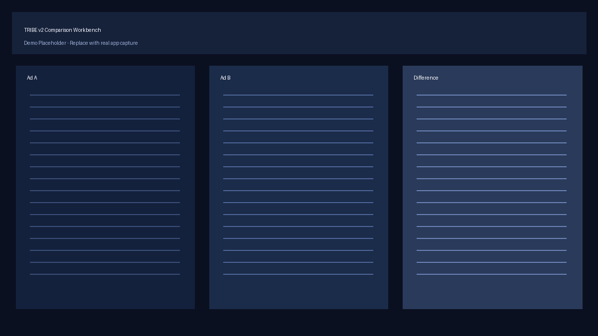

<p align="center">
  <h1 align="center">TRIBE v2 Creative Workbench</h1>
  <p align="center">
    Compare how different video stimuli activate the brain — powered by Meta's TRIBE v2.
  </p>
</p>

<p align="center">
  <a href="https://opensource.org/licenses/MIT"></a>
  <a href="https://www.python.org/downloads/"></a>
  <a href="https://huggingface.co/facebook/tribev2"></a>
  <a href="https://creativecommons.org/licenses/by-nc/4.0/"></a>
</p>

<p align="center">
  <a href="#quick-start">Quick Start</a> &bull;
  <a href="#notebook">Notebook</a> &bull;
  <a href="#full-usage">Full Usage</a> &bull;
  <a href="#how-it-works">How It Works</a> &bull;
  <a href="#acknowledgments">Acknowledgments</a>
</p>

<!-- TODO: Replace with a screen recording or GIF of the demo UI.
     Record ~30s of the app, convert with:
       ffmpeg -i recording.mov -vf "fps=12,scale=800:-1" -loop 0 assets/demo.gif
     Then uncomment:
     <p align="center">
       
     </p>
-->

---

## What Is This?

TRIBE v2 Creative Workbench is an open-source tool that lets you **compare how two videos activate the brain** using Meta's [TRIBE v2](https://github.com/facebookresearch/tribev2) foundation model.

Feed it two video ads (or any video stimuli), and the workbench will:

1. Run TRIBE v2 inference on each video
2. Predict cortical activity across **20,484 vertices** on the fsaverage5 brain surface
3. Compute a **time-varying difference map** between the two
4. Launch an **interactive Gradio UI** to explore the results frame by frame

> **Disclaimer:** This project is intended for research, exploration, and creative-analysis workflows. It is **not** a medical product and must not be used for diagnosis or treatment.

---

## Quick Start

**No GPU required.** The demo runs entirely on pre-computed predictions — no model download, no inference.

> **Note:** The install pulls the full dependency set (~1.2 GB) including PyTorch and the TRIBE v2 package. This is needed because the demo runs the same Gradio app as the full workbench. The install is heavier than usual, but you won't need a GPU to run it.

```bash
git clone https://github.com/aniketmallick/tribe-v2-creative-workbench.git
cd tribe-v2-creative-workbench

python3 -m venv .venv
source .venv/bin/activate
pip install -r requirements.txt

python demo.py
```

`demo.py` loads pre-computed predictions from `sample_data/` and launches the full Gradio UI instantly.

---

## Notebook

The included **[Tribe_v2_runbook.ipynb](Tribe_v2_runbook.ipynb)** walks you through the entire process end-to-end on Google Colab:

| Step | What happens |
|------|-------------|
| Environment setup | Installs dependencies, verifies GPU |
| HuggingFace login | Authenticates for gated Llama 3.2-3B access |
| Model loading | Downloads and initializes `facebook/tribev2` |
| Video input | Upload your own videos or download from URLs |
| Inference | Runs TRIBE v2 on both videos |
| Alignment & diff | Aligns predictions, computes cortical difference |
| Visualization | Plots brain surfaces for sanity checking |
| Export | Saves `pred_A.npy`, `pred_B.npy`, `diff.npy`, timing files, and videos as a zip |

The exported zip drops directly into `sample_data/` to power the local workbench.

### Running on Colab

1. Open the notebook in [Google Colab](https://colab.research.google.com/)
2. Select a **GPU runtime** (T4 or better recommended)
3. Follow the cells in order — each one is annotated with what it does and why

> **Heads up:** A ~52-second video takes roughly 30 minutes on a T4 GPU. Keep clips under 60 seconds for faster iteration.

### Using your own Colab outputs locally

After the notebook finishes, it downloads a `sample_data.zip`. To use it with the local workbench:

```bash
# Remove the bundled sample data
rm -rf sample_data/

# Extract your Colab outputs in its place
unzip sample_data.zip

# Launch the workbench with your data
python demo.py
```

---

## Full Usage

### Dependency profiles

| Profile | File | What it includes |
|---------|------|-----------------|
| **Full (demo + app)** | `requirements.txt` | Everything — inference + visualization + Gradio app (~1.2 GB) |
| **Inference only** | `requirements.inference.txt` | TRIBE v2, PyTorch, scientific stack |
| **Visualization only** | `requirements.viz.txt` | nilearn, Plotly (standalone `viz.py` CLI only — not sufficient for `demo.py` or `app.py`) |

### Demo mode (no GPU)

```bash
python demo.py
```

Loads cached predictions from `sample_data/` and launches the Gradio UI. Perfect for exploring the interface without running inference.

### Full app with live inference

```bash
python app.py
```

Upload two videos and click **Run Comparison**. Requires a GPU and the [TRIBE v2 model](https://huggingface.co/facebook/tribev2).

### CLI comparison

Run inference and save outputs without the UI:

```bash
python compare.py /path/to/video_a.mp4 /path/to/video_b.mp4 \
  --output-dir outputs \
  --cache-dir ./cache \
  --model-id facebook/tribev2
```

### Standalone visualization

Render saved predictions as interactive brain surfaces:

```bash
python viz.py \
  --pred-a outputs/pred_A.npy \
  --pred-b outputs/pred_B.npy \
  --diff outputs/diff.npy \
  --time-step 0
```

---

## How It Works

```
Video A ──┐                    ┌── Pred A (T, 20484) ──┐
          ├── TRIBE v2 Model ──┤                        ├── Difference Map ── Interactive UI
Video B ──┘                    └── Pred B (T, 20484) ──┘
```

1. **TRIBE v2** is a deep multimodal brain encoding model from Meta that predicts fMRI responses to naturalistic stimuli (video, audio, text)
2. Each video is processed into an **event timeline** (visual frames + transcribed audio + text) and fed through the model
3. Predictions are **aligned** to the shorter sequence length, then a vertex-wise absolute difference is computed
4. The **Gradio app** renders three interactive Plotly brain surfaces (Ad A, Ad B, Difference) with a time-step slider, using client-side `Plotly.restyle` updates for smooth playback

---

## Project Structure

```
tribe-v2-creative-workbench/
├── app.py                  # Gradio web app — upload videos, explore brain maps
├── compare.py              # TRIBE v2 inference, alignment, and diff computation
├── viz.py                  # fsaverage5 surface rendering with Plotly
├── demo.py                 # Launches app from cached sample_data/
├── Tribe_v2_runbook.ipynb  # End-to-end Colab notebook
├── sample_data/            # Pre-computed demo assets (predictions, videos, timing)
│   ├── pred_A.npy          #   Cortical predictions for Video A
│   ├── pred_B.npy          #   Cortical predictions for Video B
│   ├── diff.npy            #   Absolute difference map
│   ├── ad_a.mp4            #   Source video A
│   ├── ad_b.mp4            #   Source video B
│   ├── timing_a.json       #   Timing metadata for Video A
│   └── timing_b.json       #   Timing metadata for Video B
├── tests/                  # pytest test suite
├── requirements.txt        # Full dependency set
├── requirements.inference.txt
├── requirements.viz.txt
└── LICENSE                 # MIT
```

---

## Prerequisites

| Requirement | Demo mode | Full inference |
|------------|-----------|---------------|
| Python | 3.11 – 3.13 | 3.11 – 3.13 |
| GPU | Not needed | CUDA-capable GPU recommended |
| HuggingFace account | Not needed | Required (gated Llama 3.2-3B access) |
| Disk space | ~1.5 GB (dependencies + sample data) | ~10 GB (+ model weights) |

---

## License

This project's code is licensed under the **MIT License** — see [LICENSE](LICENSE).

TRIBE v2 model weights are property of Meta and licensed under [CC-BY-NC-4.0](https://creativecommons.org/licenses/by-nc/4.0/). This project **does not distribute model weights** — users must fetch them from HuggingFace ([facebook/tribev2](https://huggingface.co/facebook/tribev2)). The text encoder path requires gated access to [Llama 3.2-3B](https://huggingface.co/meta-llama/Llama-3.2-3B).

---

## Acknowledgments

- [TRIBE v2](https://github.com/facebookresearch/tribev2) — Meta's foundation model for in-silico neuroscience
- [Paper: A Foundation Model of Vision, Audition, and Language for In-Silico Neuroscience](https://ai.meta.com/research/publications/a-foundation-model-of-vision-audition-and-language-for-in-silico-neuroscience/)
- [HuggingFace model card](https://huggingface.co/facebook/tribev2)
- [Meta TRIBE v2 demo](https://aidemos.atmeta.com/tribev2)

---

<p align="center">
  Built with curiosity.
</p>
